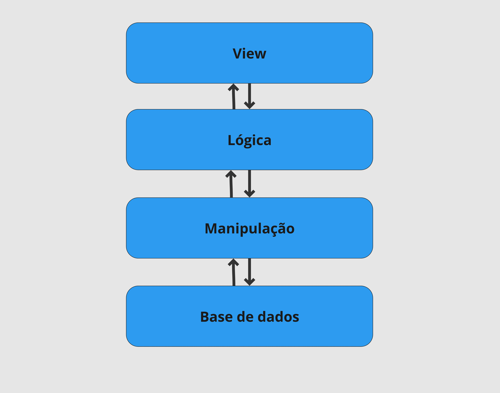

## Arquitetura

### 1. View
Todo código relacionado a estrutura do front-end. Usaremos o tailwind.
### 2. Lógica
Camada que controla o fluxo de dados e camada de *manipulação* e *view*. Também controla partes do funcionamento da *view*. Usaremos principalmente o Django.
### 3. Manipulação
Lida com toda a parte de processamento, leitura e salvamento na *base de dados*. É aqui que toda a parte de análise de sentimento e outras features estarão. Usaremos python com bibliotecas de Inteligência Artificial (OpenAI)
### 4. Base de Dados
Armazena informações de forma permanente. Usaremos o PostGRE.
### 5. Representação gráfica

## Tabela de Versionamento

| Versão | Data       | Descrição                                                     | Autor(es)    |
|--------|------------|---------------------------------------------------------------|--------------|
| 1.0    | 01/12/2024 | Criação inicial                       | Caio Pacheco |