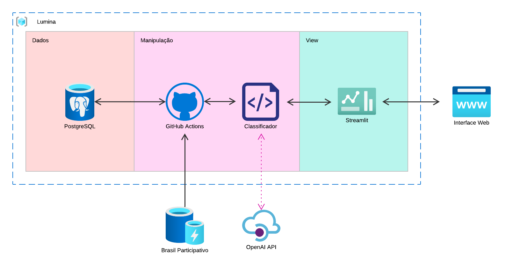

## Arquitetura

Para o desenvolvimento do nosso projeto, utilizaremos o framework Django como base.

## Diagrama de arquitetura

## Módulos arquiteturais

A arquitetura escolhida foi uma variação da arquitetura MVC (Model - View - Controller) utilizada pelo Django.

### View

Aqui é onde os resultados são apresentados aos usuários finais:

1. **Streamlit**: Ferramenta para a construção de aplicativos web interativos em Python. Exibe visualmente os resultados da classificação de sentimentos de forma acessível e fácil de interpretar.

2. **Interface Web**: A conexão entre o Streamlit e os usuários finais. Proporciona um meio para que os usuários interajam com o sistema, visualizem análises e dados processados.

### Manipulação

Esta seção é responsável pelo processamento e preparação dos dados para análise:

1. **GitHub Actions** : Uma plataforma de automação de fluxo de trabalho integrada ao GitHub, projetada para facilitar a gestão e execução de processos. No contexto do projeto, o GitHub Actions é responsável por orquestrar o fluxo de dados de forma eficiente. Utilizando arquivos YAML para definir workflows, ele realiza etapas como a extração de informações do banco de dados, aplicação de transformações nos dados brutos e preparação para a etapa de classificação, assegurando que estejam no formato esperado pelo Classificador.

2. **Classificador**: O núcleo do sistema de análise de sentimentos. Utiliza engenharia de prompt para LLM's para categorizar e atribuir sentimentos (positivo, negativo, neutro) aos dados processados. É integrado com a **OpenAI API** para utilizar modelos de linguagem na execução da análise de sentimento.

### Dados

Nessa seção, encontramos as fontes de dados primárias:

1. **PostgreSQL**: Banco de dados PostgreSQL. É responsável por armazenar os dados brutos que serão utilizados no processo de análise junto com todos os dados que já foram analisados.

2. **Site do Brasil Participativo**: Fonte dos dados brutos com todos os comentários e propostas do Brasil Participativo.

## Tabela de Versionamento

| Versão | Data       | Descrição                | Autor(es)    |
| ------ | ---------- | ------------------------ | ------------ |
| 1.0    | 01/12/2024 | Criação inicial          | Caio Pacheco |
| 2.0    | 10/12/2024 | Arquitetura de 3 modulos | Caio Pacheco |
| 3.0    | 15/12/2024 | Alteração da Arquitetura | Luiz Soares  |
