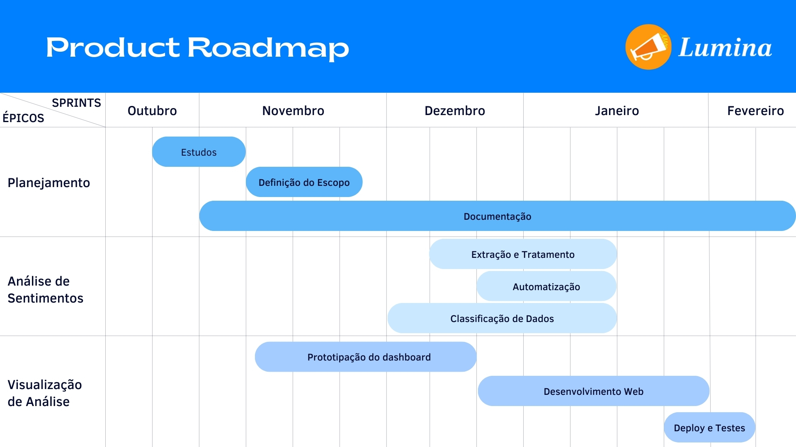

 O <strong>Backlog do Produto</strong> é uma lista ordenada que reúne todas as funcionalidades, melhorias e correções essenciais para o desenvolvimento do produto. Trata-se de um artefato dinâmico, constantemente revisado e atualizado à medida que novas informações surgem, assegurando que a equipe de desenvolvimento mantenha o foco nas tarefas de maior valor para os usuários e stakeholders. 

---

## Tabela de Backlog

A <strong>Tabela de Backlog</strong> apresentada a seguir lista os épicos e histórias de usuário priorizados, com as respectivas estimativas de esforço (<strong>Story Points</strong>) e <strong>prioridade</strong> de implementação. A priorização foi realizada utilizando a técnica <strong>Planning Poker</strong>, onde a equipe de desenvolvimento atribui valores de prioridade baseados em consenso, considerando a importância e a complexidade de cada item. Esta abordagem permite que a equipe se concentre nas tarefas mais relevantes para atender às necessidades dos usuários e stakeholders. A <strong>Tabela 1</strong> abaixo resume os principais itens do backlog do produto, enquanto a <strong>Tabela 2</strong> apresenta uma legenda para facilitar o entendimento.

<!-- Legenda acima da imagem -->

    
<em><strong>Tabela 1:</strong> Tabela de Backlog.</em>

| **Épico**                    | **História de Usuário**                                                                                                          | **Story Points** | **Prioridade**        |
|------------------------------|--------------------------------------------------------------------------------------------------------------------------|------------------|-----------------------|        
| **PLanejamento (E01)**  | Como cliente, eu quero saber se a opinião sobre um determinado tópico é positiva, negativa ou neutra. Para poder realizar a análise de sentimentos.                     | 05                | **Alta** |
| **Análise de Sentimentos (E02)**  | Como cliente, eu quero saber se a opinião sobre um determinado tópico é positiva, negativa ou neutra. Para poder realizar a análise de sentimentos.          | 13                 | **Alta** |
| **Visualização da Análise (E03)**  | Como  cliente, eu quero  visualizar por meio de gráficos o sentimento predominantes, de forma simples  e claro. Para entender como aquilo impacta a população. | 08                | **Alta** |
| **Tópicos Recorrentes (E04)**  | Como cliente eu quero identificar os tópicos recorrentes em um determinado plano. Para entender quais assuntos estão em destaque. | 08                | Baixa |

 O épico Tópicos Recorrentes (E04), que tem como objetivo permitir que os clientes identifiquem tópicos recorrentes em um determinado plano para entender quais assuntos estão em destaque, será reservado para futuras versões do projeto.

Essa decisão se baseia na prioridade baixa atribuída a esse épico no momento atual, considerando que os esforços da equipe estão concentrados em funcionalidades com maior impacto direto para os usuários e stakeholders, como análise de sentimentos e visualização de dados.

Embora seja uma funcionalidade relevante e que trará valor ao produto, sua implementação será planejada para uma etapa posterior, garantindo que as entregas prioritárias sejam realizadas de forma eficiente e dentro dos prazos estabelecidos.

### Legenda

| **Legenda**     | **Descrição**                                                                                   |
|-----------------|-----------------------------------------------------------------------------------------------|
| **Épico**       | Um **Épico** é uma grande funcionalidade ou objetivo de alto nível, que é dividido em **User Stories** menores para desenvolvimento. |
| **História de Usuário**  | Uma **História de Usuário** é uma breve descrição de uma funcionalidade escrita da perspectiva do usuário, representando uma necessidade ou desejo. |
| **Story Points**| Estimativa do esforço necessário para concluir a tarefa, seguindo a sequência de Fibonacci: 1, 2, 3, 5, 8, 13... |
| **Alta** | Prioridade máxima. Deve ser desenvolvida imediatamente por oferecer alto valor ao produto.                     |
| **Média** | Prioridade intermediária. Requer mais detalhes antes de ser implementada.            |
| **Baixa** | Prioridade menor. Pode ser deixada para fases futuras do projeto.                    |

---

## Story Map

 O <strong>Story Map</strong> é uma ferramenta visual que organiza e prioriza as histórias de usuários, alinhando-as à jornada do usuário e ao valor entregue por cada funcionalidade. Ele facilita a comunicação entre a equipe e os stakeholders, ajudando a identificar lacunas no desenvolvimento, conforme ilustrado a seguir.

<table style="width: 100%; background-color:white; border: 1px solid black; border-collapse: collapse;">
  <thead>
    <tr style="height: 43px; background-color: #f2f2f2; border: 1px solid black;">
      <th style="width: 15%; text-align: center; font-weight: bold; height: 43px; border: 1px solid black;">Epics</th>
      <th style="width: 15%; text-align: center; font-weight: bold; height: 43px; border: 1px solid black;">Features</th>
      <th style="width: 35%; text-align: center; font-weight: bold; height: 43px; border: 1px solid black;">User Stories</th>
      <th style="width: 35%; text-align: center; font-weight: bold; height: 43px; border: 1px solid black;">Descrição</th>
    </tr>
  </thead>
  <tbody>
    <!-- Épico: Análise de Sentimentos -->
    <tr>
      <td rowspan="12" style="text-align: center; writing-mode: vertical-lr; border: 1px solid black;">Análise de Sentimentos</td>
      <td rowspan="6" style="text-align: center; border: 1px solid black;">Extração e Tratamento</td>
      <td style="border: 1px solid black;">Eu como <b>usuário</b> desejo poder extrair dados do Metabase para utilizá-los na análise de sentimentos.</td>
      <td style="border: 1px solid black;">Criar integração para extração de dados do Metabase.</td>
    </tr>
    <tr>
      <td style="border: 1px solid black;">Eu como <b>usuário</b> desejo tratar os dados para garantir a consistência e adequação à análise.</td>
      <td style="border: 1px solid black;">Implementar rotina de tratamento de dados.</td>
    </tr>
    <tr>
      <td style="border: 1px solid black;">Eu como <b>usuário</b> desejo acessar os dados de eventos por meio de um endpoint no Django.</td>
      <td style="border: 1px solid black;">Desenvolver endpoint de eventos no Django.</td>
    </tr>
    <tr>
      <td style="border: 1px solid black;">Eu como <b>usuário</b> desejo acessar os dados de propostas por meio de um endpoint no Django.</td>
      <td style="border: 1px solid black;">Desenvolver endpoint de propostas no Django.</td>
    </tr>
    <tr>
      <td style="border: 1px solid black;">Eu como <b>usuário</b> desejo acessar os dados de comentários por meio de um endpoint no Django.</td>
      <td style="border: 1px solid black;">Desenvolver endpoint de comentários no Django.</td>
    </tr>
    <tr>
      <td style="border: 1px solid black;">Eu como <b>usuário</b> desejo armazenar os dados em um banco PostgreSQL para facilitar o acesso.</td>
      <td style="border: 1px solid black;">Configurar armazenamento no PostgreSQL.</td>
    </tr>
    <tr>
      <td rowspan="2" style="text-align: center; border: 1px solid black;">Automatização do processo de coleta e armazenamento</td>
      <td style="border: 1px solid black;">Eu como <b>desenvolvedor</b> desejo entender o Airflow para automatizar o fluxo de coleta e armazenamento.</td>
      <td style="border: 1px solid black;">Estudar o funcionamento do Airflow.</td>
    </tr>
    <tr>
      <td style="border: 1px solid black;">Eu como <b>usuário</b> desejo automatizar o processo de coleta e armazenamento de dados.</td>
      <td style="border: 1px solid black;">Criar DAGs no Airflow para coleta e armazenamento.</td>
    </tr>
    <tr>
      <td rowspan="4" style="text-align: center; border: 1px solid black;">Classificação de Dados</td>
      <td style="border: 1px solid black;">Eu como <b>analista</b> desejo estudar as categorias de classificação para entender melhor os dados (neutro, positivo, negativo, contributiva).</td>
      <td style="border: 1px solid black;">Realizar estudo das categorias.</td>
    </tr>
    <tr>
      <td style="border: 1px solid black;">Eu como <b>usuário</b> desejo utilizar a OpenAI para classificar os dados de forma automática.</td>
      <td style="border: 1px solid black;">Implementar classificação de dados utilizando a OpenAI.</td>
    </tr>
    <tr>
      <td style="border: 1px solid black;">Eu como <b>desenvolvedor</b> desejo automatizar o processo de classificação usando o Airflow.</td>
      <td style="border: 1px solid black;">Automatizar o processo de classificação via Airflow.</td>
    </tr>
    <tr>
      <td style="border: 1px solid black;">Eu como <b>desenvolvedor</b> desejo conteinerizar a automatização de classificação e coleta de dados.</td>
      <td style="border: 1px solid black;">Conteinerizar o processo de classificação e coleta de dados.</td>
    </tr>
    <tr>
      <td rowspan="9" style="text-align: center; writing-mode: vertical-lr; border: 1px solid black;">Visualização de Análise</td>
      <td rowspan="3" style="text-align: center; border: 1px solid black;">Prototipação do Dashboard</td>
      <td style="border: 1px solid black;">Eu como <b>designer</b> desejo criar um protótipo de baixa fidelidade para definir a estrutura inicial do dashboard de análise.</td>
      <td style="border: 1px solid black;">Criar protótipo de baixa fidelidade.</td>
    </tr>
    <tr>
      <td style="border: 1px solid black;">Eu como <b>designer</b> desejo criar um protótipo de alta fidelidade para validar a aparência e funcionalidade do dashboard.</td>
      <td style="border: 1px solid black;">Criar protótipo de alta fidelidade.</td>
    </tr>
    <tr>
      <td style="border: 1px solid black;">Eu como <b>usuário</b> desejo realizar testes no protótipo para garantir que o design seja funcional e intuitivo.</td>
      <td style="border: 1px solid black;">Realizar testes no protótipo (Isaque é bom de visualização).</td>
    </tr>
    <tr>
      <td rowspan="6" style="text-align: center; border: 1px solid black;">Desenvolvimento Web (Streamlit)</td>
      <td style="border: 1px solid black;">Eu como <b>usuário</b> desejo acessar uma página inicial que me apresente uma visão geral do sistema de análise de sentimento.</td>
      <td style="border: 1px solid black;">Desenvolver a página inicial.</td>
    </tr>
    <tr>
      <td style="border: 1px solid black;">Eu como <b>usuário</b> desejo acessar uma página de planos participativos para visualizar informações relevantes.</td>
      <td style="border: 1px solid black;">Desenvolver a página de planos participativos.</td>
    </tr>
    <tr>
      <td style="border: 1px solid black;">Eu como <b>usuário</b> desejo acessar um dashboard que me permita visualizar as análises de sentimento de forma clara e detalhada.</td>
      <td style="border: 1px solid black;">Desenvolver o dashboard de análise de sentimento.</td>
    </tr>
    <tr>
      <td style="border: 1px solid black;">Eu como <b>usuário</b> desejo que o sistema integre os dados coletados para que o dashboard esteja sempre atualizado.</td>
      <td style="border: 1px solid black;">Implementar integração com os dados coletados.</td>
    </tr>
    <tr>
      <td style="border: 1px solid black;">Eu como <b>desenvolvedor</b> desejo conteinerizar a página para facilitar o deploy e garantir portabilidade.</td>
      <td style="border: 1px solid black;">Conteinerizar a página.</td>
    </tr>
    <tr>
      <td style="border: 1px solid black;">Eu como <b>desenvolvedor</b> desejo realizar o deploy do projeto para torná-lo acessível aos usuários finais.</td>
      <td style="border: 1px solid black;">Realizar o deploy do projeto.</td>
    </tr>
  </tbody>
</table>

As Features descritas na tabela acima foram organizadas em um board visual, que facilita o planejamento e execução do projeto ao oferecer uma visualização clara das tarefas, permitindo colaboração em tempo real, flexibilidade para reordenar prioridades e transparência no acompanhamento por meio do registro de comentários e histórico de mudanças. Isso garante maior alinhamento e eficiência entre os membros da equipe.

<iframe width="768" height="432" src="https://miro.com/app/live-embed/uXjVL4gxdzE=/?moveToViewport=-2767,-1368,6243,2550&embedId=396833406474" frameborder="0" scrolling="no" allow="fullscreen; clipboard-read; clipboard-write" allowfullscreen></iframe>

---

## Roadmap

 O <strong>Roadmap</strong> é um plano estratégico que descreve os objetivos do produto e as principais entregas ao longo do tempo. Ele define as etapas que a equipe seguirá para alcançar as metas do produto, servindo como um guia para o planejamento de releases e sprints. O roadmap proporciona uma visão clara para todos os envolvidos no projeto, alinhando a direção e as expectativas do desenvolvimento, conforme ilustrado abaixo.

---

Tabela de Versionamento

| Versão | Data       | Descrição                                                     | Autor(es)        |
|--------|------------|---------------------------------------------------------------|------------------|
| 1.0    | 28/11/2024 | Criação inicial                       | Gabriel Pinto |
| 1.1    | 01/12/2024 | Estruturação e atualização                       | Gabriel Pinto |
| 1.2    | 10/12/2024 | Atualização do StoryMap                       | Gabriel Pinto |
| 1.3    | 11/12/2024 |  Atualização do Roadmap                      | Gabriel Pinto |
